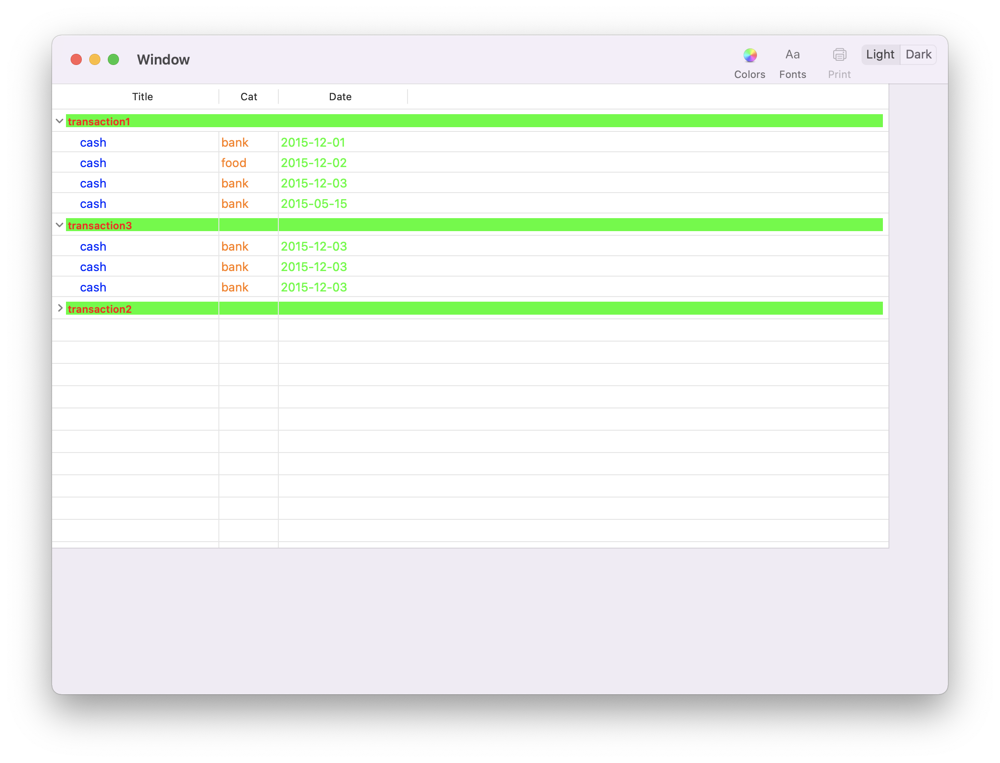
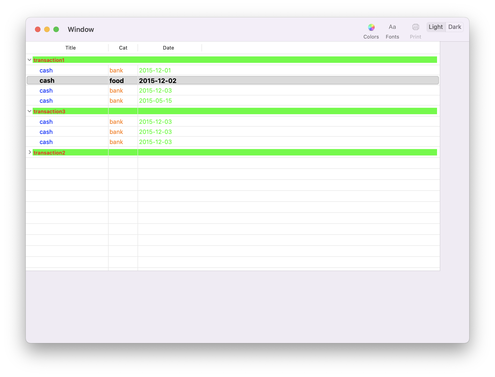
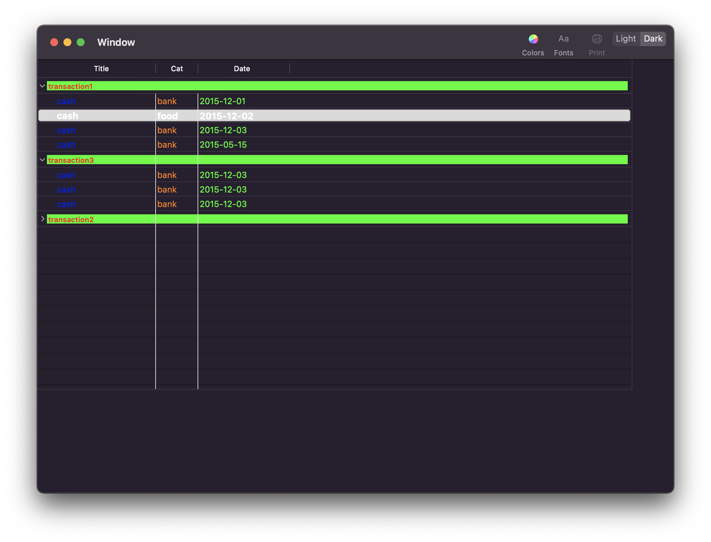

testOutline
======================
<p align="center">


</p>


# Just an exercice for itemForPersistentObject and persistentObjectForItem


## itemForPersistentObject
When the outline view is restoring the saved expanded items, this method is called for each expanded item, to translate the archived object to an outline view item.


## persistentObjectForItem
When the outline view is saving the expanded items, this method is called for each expanded item, to translate the outline view item to an archived object.


# nstableview change isselected text color NSTableRowView

## 1. Start with subclassing NSTableRowView

```swift
class CategoryTableRowView: NSTableRowView {

override func drawSelection(in dirtyRect: NSRect) {
    if selectionHighlightStyle != .none {
        let selectionRect = bounds.insetBy(dx: 2.5, dy: 2.5)
        NSColor(calibratedRed: 61.0/255.0, green: 159.0/255.0, blue: 219.0/255.0, alpha: 1.0).setStroke()
        NSColor(calibratedWhite: 1.0, alpha: 1.0).setFill()
        let selectionPath = NSBezierPath(roundedRect: selectionRect, xRadius: 25, yRadius: 25)
        selectionPath.fill()
        selectionPath.stroke()
    }
  }
}
```

## 2. Return custom CategoryTableRowView() in the NSTableViewDelegate method

```swift
func tableView(_ tableView: NSTableView, rowViewForRow row: Int) -> NSTableRowView? {
      return CategoryTableRowView()
}
```

## 3. Make sure you have selectionHighlightStyle to regular in your ViewController class

```swift
override func viewDidLoad() {
     super.viewDidLoad()
     self.outlineView.selectionHighlightStyle = .regular
}
```

## 4. To set the textColor, create a subclass of NSTableCellView

override the backgroundStyle property and set the desired color for the text.

```swift
class CategoryCellView: NSTableCellView {
    
    var oldColor : NSColor? = nil
    var oldFont : NSFont? = nil

    override var backgroundStyle: NSView.BackgroundStyle {
        willSet{
            if newValue == .emphasized {
                
                textField?.font = NSFont.systemFont(ofSize: 14)
                textField?.textColor = NSColor.textColor
            } else {
                if oldColor == nil {
                    oldColor = textField?.textColor!
                    oldFont = textField?.font
                }
                textField?.textColor = oldColor
                textField?.font = oldFont
            }
            super.backgroundStyle = newValue
        }
    }
}
```

Note: In my case, I have a custom cell which has a categoryTextField outlet.So to set the text color I use: 
```swift
textField.textColor = NSColor.textColor
```

## 5. Set custom class inside storyboard


<p align="center">

<p align="center">
<em>Normal</em> 
</p>
</p>

<p align="center">

<p align="center">
<em>Select light</em> 
</p>
</p>

<p align="center">

<p align="center">
<em>Select dark</em> 
</p>
</p>

